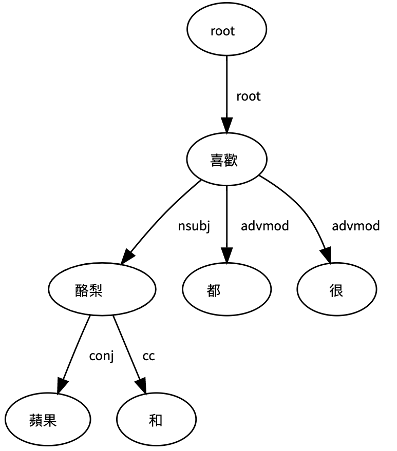

# Dep Tree Module 
- Author: Ching Wen Yang 
- Date Created: 2022/8/24 
---
### Defined Relations  
For defined relations (`DepRealtion`, `POS`...), refer to `src/utils.py`.  

### Rules with Pseudo Code

#### <span style="color:#BE4977">Rule 1: Noun Blocking</span>

For a detected opinion, if a noun is detected in the subtree, then the noun is said to be **blocking** the opinion to find its aspect. This noun is promoted to the aspect level ((i.e. this aspect may NOT be in the aspect lexicon, but detected via syntatic relations; this way we can somehow break the lexicon limit). 
eg. "老闆娘很好。"
「老闆娘」is originally not in the aspect lexicon, but because it is a NA in 「好」's subtree, it will be detected and promoted to aspect. 
Implemented in `DepTree.get_pairing()`. 
##### PsuedoCode
```
// opn.neighbors: opinion's directed neighbors
for opn in detected_opinions:
    for v in opn.neighbors:
        // (1) v is in POS.Nouns
        // (2) (opn, v) is DepRelation.NSUBJ
        // (3) v is BEFORE opn in terms of sentence position 
         eg.「老闆娘」很「好」（「老闆娘」句子位置比「好」更前）
         if (1) or (2) and (3):
             // Noun Blocking is detected
             // v is promoted to be an aspect 
```


####  <span style="color:#BE4977"> Rule 2: Conjunction Detection </span>

For a detected aspect`asp`, if there's another word 
that is linked to it by a conjunction word, then this word is denoted `partner`, and is promoted to aspect level (i.e. this aspect may NOT be in the aspect lexicon, but detected via syntatic relations; this way we can somehow break the lexicon limit). 
These 2 aspects then share the same set of opinion expressions. 
eg. "蘋果和酪梨都很喜歡"。
Implemented in `DepTree.get_conjunctions()`, `DepTree.conj_detect()`. 



##### PsuedoCode
```
// aspects: this particular opinion's linked aspects 
// conjunctions: the global (the overall tree) detected conjunction relations, deteted using `if depr == DepRelation.CC: #（和）`


for opn, aspects in detected_opinions:
    for asp in aspects:
        if asp in conjunctions: 
            partner = asp 
            // add the opinion expression 
            // into `partner` opinion lists (avoid duplicates)
            // add the opinion expression into 
            // `asp`'s opinion lists (avoid duplicates)

```


####  <span style="color:#BE4977"> Rule 3: Polarity Inversion </span>
Reverse Polarity if a negative token is found in the subtree (outedges) of a detected opinion `opn`. 
eg. "這顆蘋果不好吃"。
Implemented in `DepTree.neg_detect()`. 

##### PsuedoCode
```
// opn.neighbors: opinion's directed neighbors


for opn in detected_opinions:
    for v in opn.neighbors:
        if (opn, v) is DepRelation.NEG:
            neg_token = v 
            // reverse opn polairty 
            // add v into the opinion expression, i.e.  
            opinion expression becomes (neg_token, opn)
     
```
####  <span style="color:#BE4977"> Rule 4: POS Exclusion </span>

In the procedure of detecting aspects and opinions from the lexicons, 
for opinions, if we exactly match a token as an opinion word, 
we further detect its associated POS tag and check if it is in 
POS.Adverbs. If yet, the word is **excluded** from the detected opinion list. 
eg. 「服務很可以 (VH)」 VS.「可以 (D) 一口接一口喝」
前者的「可以」應該被標註，但後者則不該。

Implemented in `DepTree.detect()`
    
##### PsuedoCode
(skipped)

####  <span style="color:#BE4977"> Rule 5: Period-Blocking</span>

If a A-O pair crosses the boundary (defined as POS.PERIODCATEGORY, POS.EXCLAMATIONCATEGORY), ignore the pair. 
Because this function is implemented independently, the code snippet is pasted below. 

```
def isCrossed(self, aspid, opnid):
    for period_id in self.periods:
        if aspid < period_id < opnid:
            self.logger.info(f'[Rule 5] Detected crossing boundary pair {self.node2tok(aspid)} and {self.node2tok(opnid)}, ignore the pair.')
            return True
    return False
```